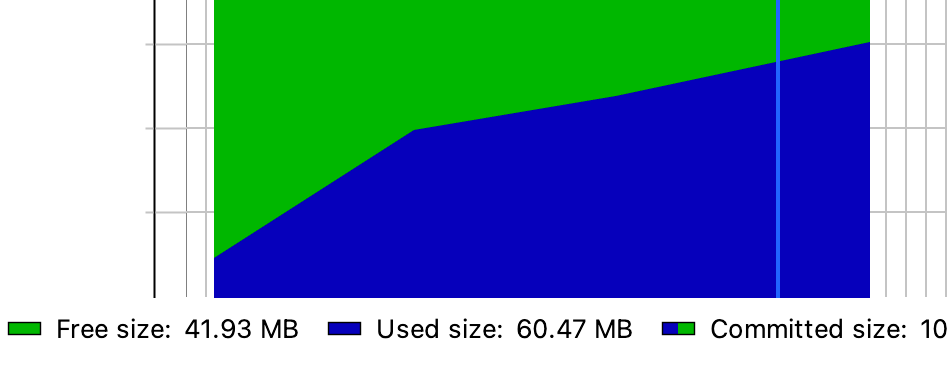
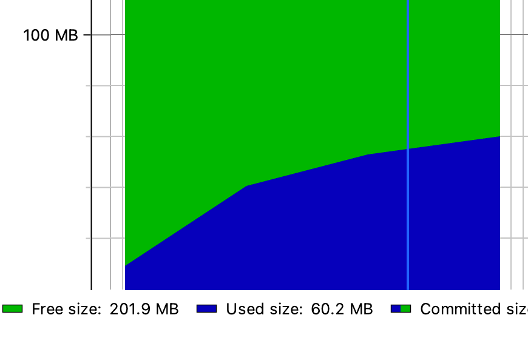
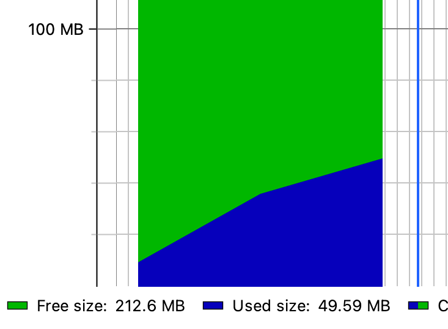
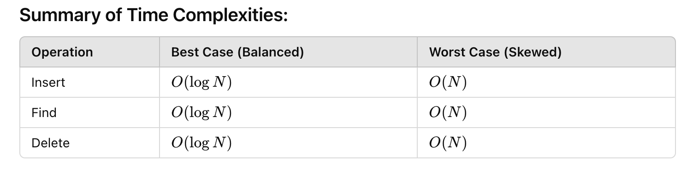

## Binary search tree & Counting sort, Profiling

### AVL BST (Balanced Binary Search Tree) Profiling

#### Profile time consumption (Confirm that you see O (log n))
Input-Sensitive Profiler - JMH (Java Microbenchmark Harness)
- mvn clean install
- java -jar target/jmh-benchmarks.jar AVLTreeBenchmark

```
Benchmark                     (size)  Mode  Cnt    Score   Error  Units
AVLTreeBenchmark.testDelete    10000  avgt    2   12.783          ns/op
AVLTreeBenchmark.testDelete   100000  avgt    2   15.402          ns/op
AVLTreeBenchmark.testDelete  1000000  avgt    2   17.214          ns/op
AVLTreeBenchmark.testInsert    10000  avgt    2  113.520          ns/op
AVLTreeBenchmark.testInsert   100000  avgt    2  115.521          ns/op
AVLTreeBenchmark.testInsert  1000000  avgt    2  128.707          ns/op
AVLTreeBenchmark.testSearch    10000  avgt    2   93.694          ns/op
AVLTreeBenchmark.testSearch   100000  avgt    2  149.904          ns/op
AVLTreeBenchmark.testSearch  1000000  avgt    2  434.031          ns/op
```
In summary, the search operation's growth pattern suggests the possibility of O(log n), 
while the insert and delete operations seem to behave more like O(1) based on the specific benchmarks.

#### Profile space usage (Confirm that you see O (n))
IntelliJ JProfiler plugin
- Run tests with JProfiler and check memory usage

##### Insert


##### Search


##### Delete


### Binary Search Tree


We can observe O(n) as memory increases as the dataset increases.

Having 100 datasets for testing insert, find and delete operations on BST obtained the following results (one insert/search/delete in 100 datasets):
```
[INSERT] AVERAGE TIME = 1416.26365 nano = 0.0014163 ms
[SEARCH] AVERAGE TIME = 1599.30425 nano = 0.0015993 ms
[DELETE] AVERAGE TIME = 1248.82313 nano = 0.0012488 ms
```
Results are approximately the same (0.001 ms).

### Counting sort
A testing was performed on sorting a short and a large dataset.
```
SHORT ARRAY time: [1947404] nano
LARGE ARRAY time: [7561119] nano
```
- Its time and space complexity is O(N+M), where N = length and M = maxValue, so it's not efficient with large arrays. 
- Requires elements to be mapped to integers, so will not perform well with complex objects. 
- Requires additional arrays, which makes it bad memory usage.