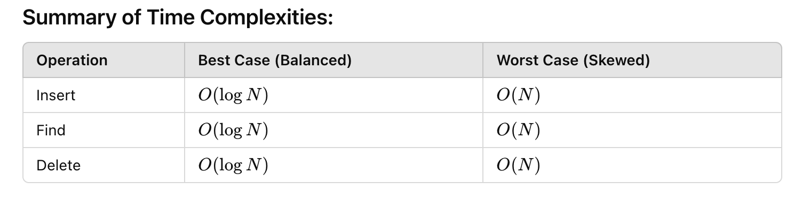

## Binary search tree & Counting sort

### Balanced Binary Search Tree


Having 100 datasets for testing insert, find and delete operations on BST obtained the following results (one insert/search/delete in 100 datasets):
```
[INSERT] AVERAGE TIME = 1416.26365 nano = 0.0014163 ms
[SEARCH] AVERAGE TIME = 1599.30425 nano = 0.0015993 ms
[DELETE] AVERAGE TIME = 1248.82313 nano = 0.0012488 ms
```
Results are approximately the same (0.001 ms).

### Counting sort
A testing was performed on sorting a short and a large dataset.
```
SHORT ARRAY time: [1947404] nano
LARGE ARRAY time: [7561119] nano
```
- Its time and space complexity is O(N+M), where N = length and M = maxValue, so it's not efficient with large arrays. 
- Requires elements to be mapped to integers, so will not perform well with complex objects. 
- Requires additional arrays, which makes it bad memory usage.